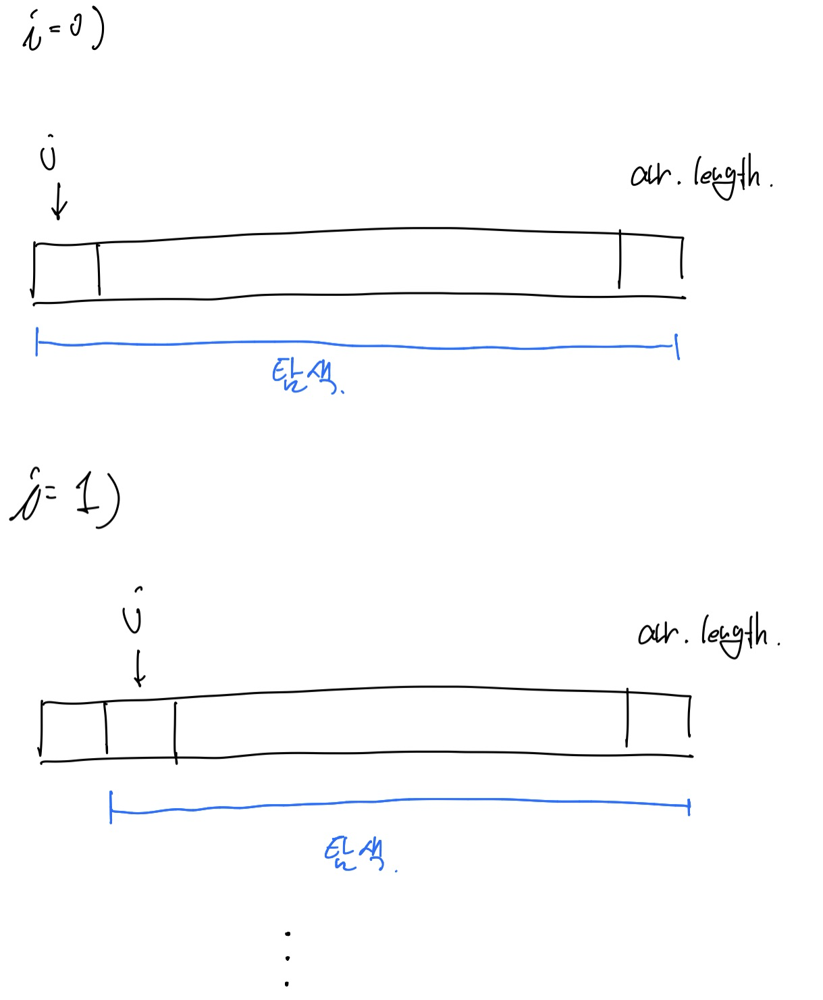
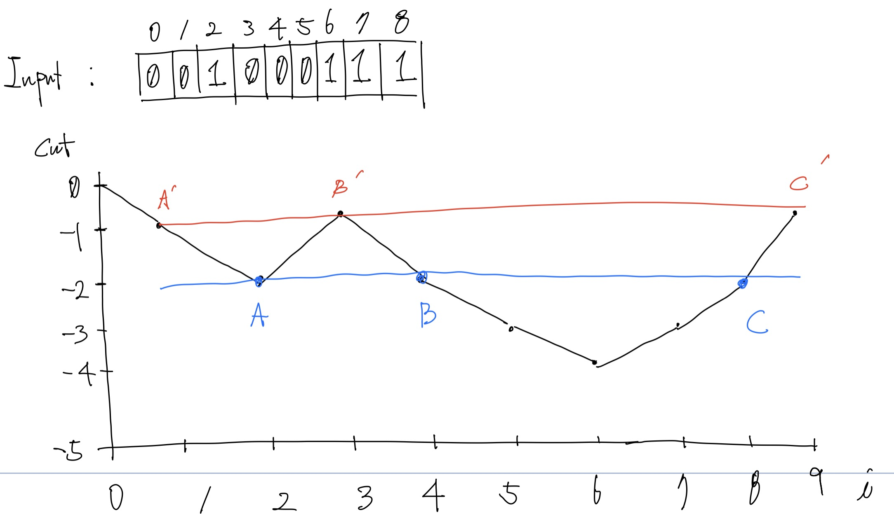

# LeetCode_525_ContiguousArray

## Problem

> https://leetcode.com/problems/contiguous-array/

Given a binary array, find the maximum length of a contiguous subarray with equal number of 0 and 1. 

**Example 1:**

```
Input: [0,1]
Output: 2
Explanation: [0, 1] is the longest contiguous subarray with equal number of 0 and 1.
```


**Example 2:**

```
Input: [0,1,0]
Output: 2
Explanation: [0, 1] (or [1, 0]) is a longest contiguous subarray with equal number of 0 and 1.
```


**Note:** The length of the given binary array will not exceed 50,000.


## Solution

### 문제 해석

* **부분배열**을 찾는다.
* 0과 1의 갯수가 같아야 한다.
* 그 중 배열의 길이가 가장 긴 배열의 길이를 output으로 한다.

**Example3:**

```
Input: [1,1,1,1,1, 0,0,0,0,0]
output: 10
Explanation: 0과 1의 갯수가 같은 부분배열은 [0, 1], [1,1, 0,0], [1,1,1, 0,0,0], [1,1,1,1, 0,0,0,0] [1,1,1,1,1, 0,0,0,0,0] 이다.
이중 가장 긴 부분배열은 [1,1,1,1,1, 0,0,0,0,0] 이므로 10이다.
```


**Example4:**

```
Input: [0,1,1,0,1,1,1,0]
output: 4
Explanation: 0과 1의 갯수가 같은 부분배열은 [0,1], [1,0], [0,1,1,0]이다.
이중 가장 긴 부분배열은 [0,1,1,0] 이므로 4이다.
```


### 방법1(Time Limit Exceeded)

brute force를 이용한 방법

부분배열내의 0과 1을 찾기위해 이중 for문을 사용한다.

부분 배열을 탐색하는 도중 0과 1의 갯수가 같은 경우 max함수를 이용해 length를 비교한 후 `r`에 저장한다.



```swift
// https://leetcode.com/problems/contiguous-array/

class Solution {

    func findMaxLength(_ nums: [Int]) -> Int {

        var r: Int = 0
        for i in 0 ..< nums.count{
            var one = 0
            var zero = 0
            for j in i ..< nums.count{
                if nums[j] == 1{
                    one += 1
                }else{
                    zero += 1
                }

                if zero == one{
                    r = max(r, j-i+1)
                
                }
            }
        }

        return r
    }
}


let sol = Solution()
// 01111100000 -> [0,1], [1,1,1,1,1, 0,0,0,0,0], ...
let input: [Int] = [0, 1, 1, 1, 1, 1, 0, 0, 0, 0, 0]//[0,1,0]
print(sol.findMaxLength(input))
```


### 방법2(Time Limit Exceeded)

방법 1에서 추가로 배열 탐색도중 현재 r(max값)이 그 뒤에 검사해야할 배열의 갯수보다 크거나 같을 경우 r을 리턴한다.

```swift
// https://leetcode.com/problems/contiguous-array/

class Solution {

    func findMaxLength(_ nums: [Int]) -> Int {

        var r: Int = 0
        for i in 0 ..< nums.count{
            var one = 0
            var zero = 0
            for j in i ..< nums.count{
                if nums[j] == 1{
                    one += 1
                }else{
                    zero += 1
                }

                if zero == one{
                    r = max(r, j-i+1)
                    if r >=  nums.count - i - 1{
                        return r
                    }
                }
            }
            
        }

        return r
    }
}


let sol = Solution()
let input: [Int] = [1,0,0,1,0,0,0,1,0,1,0,1,0,1,0,0,1,1,1,0,1,0,1,0,1,1,0,1,1,1,1,0,0,1,1,0,0,1,1,1,1,1,0,1,0,1,0,0,1,0,0,0,0,0,0,1,0,0,0,1,0,1,0,1,0,1,0,1,0,0,0,0,1,1,1,0,1,0,0,0,0,0,0,1,0,0,0,0,0,1,0,1,0,1,1,1,1,1,1,0]//[0, 1, 1, 1, 1, 1, 0, 0, 0, 0, 0]//[0,1,0]
print(sol.findMaxLength(input))
```


### 방법 3

방법 3은 도저히 안풀려서(Time Limit Exceeded) 결국 leetCode에 나온 Solution을 정리한 내용이다.

```
Input: [0, 0, 1, 0, 0, 0, 1, 1, 1]
```

Input 배열을 for문으로 순회하면서 각 index마다 0이면 -1, +1을 cnt에 더한다.

그림을 그리면 아래와 같은 그래프를 그릴 수 있다.

(i = 0일 때 cnt는 0에서 -1이 되서 i = 1일 때 cnt는 -1 이다.)



해당 그래프에서 가장 많은 점(좌표)를 갖고 있는 cnt 값에 주목하자(빨간색 선과 파란색 선)

각 선의 점들 (A', B', C'), (A, B, C) 의 의미는 0과 1의 갯수가 같아지는 부분집합을 의미하며 

이 중 각 선 중 가장 긴 선분인 (A', C')와 (A, C)를 비교해 가장 긴 값이 우리가 원하는 **가장 긴 길이를 가진 부분집합이 될 것이다.**

빨간색의 length는 9 - 1 = 8이 될 것이고, 가장 긴 부분집합은 index 1 ~ (9-1)까지인 `[0, 1, 0, 0, 0, 1, 1, 1]` 이 될 것이다.

파란색의 length는 8 - 2 = 6 이고, 부분집합은 index 2 ~ (8-1) 까지인 `[1, 0, 0, 0, 1, 1]`  이 될 것이다.

빨간색과 파란색의 length를 비교했을 때 빨간색이 더 크다. 따라서 **output은 8이다.**


이제 이것을 코드로 적용할 경우를 생각해보자

HashMap을 이용하면 간단하게 풀 수 있다.

우선 dictionary 하나가 필요하다. count와 index의 관계를 저장하기 위해 필요하다.

[key(count), value(index)] 꼴로 값을 저장한다. (index가 length에 영향을 주기 때문에 value로 저장)

* count의 값은 1이면 +1, 0이면 -1을 저장하도록 한다.
* 만약 count의 값이 이전 index와 같다면 (다시 수렴 했다는 의미로 판단.{위의 그림의 점들을 생각하면 각 count가 다시 같아지는 부분임.}) 위의 그림처럼 하나의 선이 그어졌다고 판단하기에 현재 index와 해당 count의 index사이의 길이가 부분 집합의 length가 될 것이다. max함수를 이용해 이전 maxLen과 비교하도록 한다.
* count의 값이 이전 index와 같지 않다면(count값이 존재하지 않는다면, 그래프가 내려가거나 올라가는 중이라는 의미 수렴하지 않았다는 의미) 새로운 [count, index] 쌍을 저장해준다.
* 위의 내용을 반복해 최종적으로 maxLen을 리턴한다.

```swift
// https://leetcode.com/problems/contiguous-array/

class Solution {

    func findMaxLength(_ nums: [Int]) -> Int {
        var dict = [Int: Int]()
        dict[0] = -1
        var maxL = 0
        var cnt = 0
        for i in 0 ..< nums.count{
            cnt = cnt + (nums[i] == 1 ? 1 : -1)
            if let contain = dict[cnt]{
                maxL = max(maxL, i - contain)
            }else{
                dict[cnt] = i
            }
        }
         
        return maxL
    }
}


let sol = Solution()
let input: [Int] = [1,0,0,1,0,0,0,1,0,1,0,1,0,1,0,0,1,1,1,0,1,0,1,0,1,1,0,1,1,1,1,0,0,1,1,0,0,1,1,1,1,1,0,1,0,1,0,0,1,0,0,0,0,0,0,1,0,0,0,1,0,1,0,1,0,1,0,1,0,0,0,0,1,1,1,0,1,0,0,0,0,0,0,1,0,0,0,0,0,1,0,1,0,1,1,1,1,1,1,0]//[0, 1, 1, 1, 1, 1, 0, 0, 0, 0, 0]//[0,1,0]
print(sol.findMaxLength(input))
```

